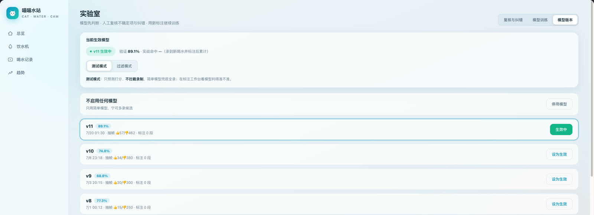
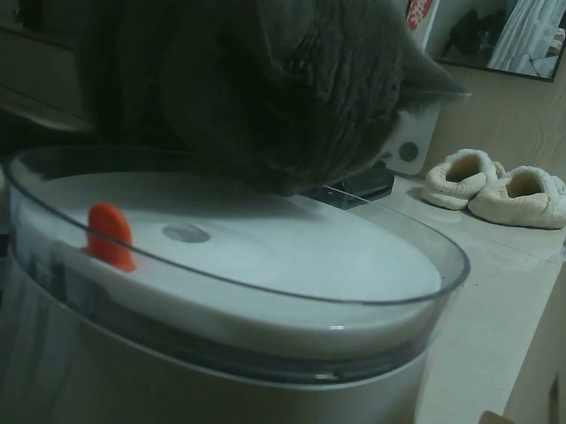

# 喵喵水站 Cat Water Cam

[](#测试)
[](https://www.python.org/)
[](LICENSE)
[](https://github.com/Tght1211/cat-water-cam/releases/latest)

普通 USB 摄像头加一台常开电脑，就能搭建纯本地的猫咪饮水监控：发现猫靠近饮水机后录下完整会话，用本地视频模型判断是否真的喝水，在网页查看实时画面、喝水记录、趋势、饮水机状态，并通过人工纠错持续训练。



## 真实效果

下面是项目真实采集、人工确认的喝水片段，不是合成素材。点击封面可播放原始 MP4。

[](https://github.com/Tght1211/cat-water-cam/releases/download/v0.2.0/cat-drinking-demo.mp4)

> 真实录像会包含家庭环境。默认配置只在本机保存画面；决定公开自己的数据前，请先检查隐私内容。

## 能做什么

- **持续采集与流畅预览**：采集、检测、录制分线程，网页通过 MJPEG 查看实时画面。
- **完整会话录像**：触发前保留 pre-roll，猫离开后延迟收尾，H.264 MP4 可直接在浏览器播放。
- **本地动作识别**：S3D 冻结视频特征加轻量分类头，识别“舔水动作”，不是只看一张静态图片。
- **开箱即用的预训练模型**：首次启动自动登记内置分类头，并以 `shadow` 模式运行；已有模型库不会被覆盖。
- **主动复核、人工纠错**：复核无判断、不确定和 AI/本地意见不同的片段，并稳定抽查约 10% 的高置信结果；视频训练只信任人工确认标签。
- **一键训练与热切换**：网页训练新版本，点击“设为生效”后立即用于下一段录像，无需重启采集进程。
- **可选外部视觉模型**：支持 OpenRouter 或其他 OpenAI 兼容视觉接口；也可以替换成本地自定义裁判。
- **趋势与饮水机管理**：确认后的喝水次数、时间分布、剩余水量估算、滤芯周期和补水校准。
- **可选录音**：旁路采集麦克风，会话结束后合入 AAC 音轨；失败时保留无声视频，不影响主流程。
- **局域网与隐私**：网页默认监听 `127.0.0.1`；只有显式设置 `0.0.0.0` 才对局域网开放。

## 快速开始

```bash
git clone https://github.com/Tght1211/cat-water-cam.git
cd cat-water-cam
python3 -m venv .venv
.venv/bin/pip install -e .
.venv/bin/pip install -r requirements.txt
.venv/bin/python -m catcam
```

打开 <http://127.0.0.1:8000>。首次运行会生成被 gitignore 的 `config.json` 和 `data/`。

没有摄像头时，可以先运行内置演示：

```bash
.venv/bin/python -m catcam.demo
```

也可以把 `config.json` 的 `video_source` 改成一段本地 MP4，测试完整检测与录制链路。

## 预训练模型

仓库包含 `catcam/assets/pretrained_s3d_head_v11.npz`：

| 项目 | 数值 |
| --- | ---: |
| 模型结构 | torchvision S3D 冻结主干 + logistic 分类头 |
| 喝水 / 没喝训练片段 | 57 / 462 |
| 验证集 top1 | 89.1% |
| 分类头大小 | 约 13 KB |
| 默认模式 | `shadow`，只预测、不阻止候选录像 |

全新安装第一次启动时，该模型会复制到 `data/models/` 并自动登记。S3D 主干权重由 torchvision 首次使用时下载，约 30 MB。Release 同时提供独立模型文件，便于校验、部署或集成到其他项目。

这个模型来自特定的猫、饮水机、相机角度和光照，只适合作为起点。迁移到新环境后，先保持 `shadow` 模式观察结果，再用自己的录像纠错和重训；不要仅凭 89.1% 就直接假设所有环境都同样准确。

## 模型工作流

### 1. 直接使用内置模型

首次启动后，内置模型立即参与后续视频的影子预测。模型结果可在“实验室 → 复核与纠错”查看。

- `shadow`：简单检测器继续负责多录候选，本地视频模型只预测和累计实战结果。
- `gate`：本地视频模型成为裁判，机器标签会用于喝水统计；画面不发送到外部服务。

建议先使用 `shadow`，积累足够的真实纠错数据后再考虑 `gate`。

### 2. 用自己的数据重新训练

1. 保持采集运行，让简单检测器多录候选。
2. 在“实验室 → 复核与纠错”处理不确定片段，并抽查模型高置信结果。
3. 在“模型训练”点击“训练视频模型”。只使用人工标签；同一半小时的录像分在同一组，按组分出固定验证集，其余用于训练。AI 标签须人工确认后才加入。特征缓存减少重复计算，数据和参数不变时复用已有版本。
4. 重点查看召回、精确率和平衡准确率。版本会保存混淆矩阵、样本清单及数据指纹；旧版有训练清单且无验证泄漏时，在同一验证集对比当前模型。
5. 新版默认只供影子测试。人工验证集每类至少 10 段，召回、精确率、平衡准确率均达到 80%，且可比的当前模型指标没有超过 2 个百分点的退步，才允许切换过滤模式。旧版无独立验证记录时只能新切换到影子模式，需重训取得证据。已有运行配置不会被自动改写。

固定划分保存在 `data/training/holdout.json`（实际位置跟随 training_dir），新增数据或纠错不会让旧训练样本进入验证集。缺少跨时段、跨类别样本时会明确要求补标，而不是输出虚高分数。不要删除该文件来挑选更好看的分数。这是工程准入门槛，不代表已证明跨环境泛化；上线前仍应观察新时段实战数据。详细设计见 [迭代设计](docs/model-iteration.md)。

也可以使用命令行：

```bash
.venv/bin/python -m catcam.video_train
```

### 3. 接入其他本地模型

本地视频裁判遵循简单接口：

```python
class MyClipJudge:
    version = "my-model-v1"

    def judge(self, clip_path):
        # 返回 catcam.judge.Verdict，失败返回 None
        ...
```

可以参考 `catcam/videojudge.py` 的 `LocalVideoClipJudge`，将其替换为 VideoMAE、X3D、自己训练的 PyTorch 模型或其他视频动作识别器。编排逻辑位于 `catcam/judge.py:route_clip`。

### 4. 接入外部 AI 视觉模型

项目提供 OpenAI 兼容视觉适配器，可连接 OpenRouter、兼容网关或自己的本地视觉服务：

```json
{
  "ai_label_enabled": true,
  "ai_base_url": "https://openrouter.ai/api/v1",
  "ai_api_key": "你的 API Key",
  "ai_model": "支持视觉输入的模型名",
  "ai_fallback_models": [],
  "ai_label_frames": 3
}
```

在 `shadow` 模式下，外部视觉模型可提供辅助标签，本地模型用于影子评估；AI 标签仍可影响现有业务统计，但必须人工确认后才进入新视频训练。在 `gate` 模式下，本地模型直接裁判，不再调用外部视觉服务。人工标签始终优先，外部 AI 不会覆盖人工纠错。

开启外部视觉模型会上传抽取的视频帧，和“纯本地”目标存在冲突。没有明确接受这一点时，请保持 `ai_api_key` 为空。

## 常用配置

| 配置项 | 说明 |
| --- | --- |
| `camera_index` / `video_source` | 摄像头编号，或用于测试的本地视频路径 |
| `bowl_roi` | 0–1 比例的饮水机区域 `[x1,y1,x2,y2]` |
| `dwell_seconds` | 猫在区域内停留多久开始录制 |
| `preroll_seconds` | 触发前补录时长 |
| `session_end_grace_seconds` | 猫离开多久后结束会话 |
| `max_session_seconds` | 单段视频最长时长 |
| `record_at_night` | 弱光环境下是否继续记录 |
| `record_audio` | 是否采集并合入麦克风音轨，默认关闭 |
| `audio_input_format` / `audio_device` | ffmpeg 音频输入格式与设备 |
| `web_host` / `web_port` | 默认 `127.0.0.1:8000`；`0.0.0.0` 会暴露到局域网 |
| `max_clips` | 视频保留上限；自动裁剪只删除确认“没喝”的旧片段 |
| `filter_cycle_days` | 饮水机滤芯更换周期 |

macOS 开启录音后，需要给运行项目的终端授予“系统设置 → 隐私与安全性 → 麦克风”权限。运行状态可访问 `/api/audio/status`。

## 架构

```text
USB 摄像头 / 视频文件
        │
        ├── 采集线程 ──► LatestFrame ──► MJPEG 网页预览
        │      │
        │      ├──► FrameBuffer ──► DrinkSession ──► MP4
        │      │                                      │
        │      │                                      ├──► 可选音频合成
        │      │                                      └──► 本地/外部视频裁判
        │      │
        └── 检测循环 ──► YOLO + 运动启发式 ──► Presence

SQLite：events（候选/预测） + labels（人工、AI、本地裁判标签）
```

核心模块：

- `catcam/app.py`：采集、线程和组件装配
- `catcam/session.py`：完整饮水会话状态机
- `catcam/videojudge.py`：S3D 特征与本地视频裁判
- `catcam/video_trainer.py`：视频模型训练与特征缓存
- `catcam/judge.py`：本地/外部裁判路由
- `catcam/web.py`：FastAPI 与单文件本地网页
- `catcam/audio.py`：音频环形缓冲与 ffmpeg 合成

## 测试

测试不依赖真实摄像头或线上模型：

```bash
.venv/bin/pytest -q
```

## Release 资产

[`v0.2.0`](https://github.com/Tght1211/cat-water-cam/releases/tag/v0.2.0) 包含：

- `cat-drinking-demo.mp4`：真实采集、人工确认的小猫喝水视频
- `catcam-pretrained-s3d-head-v11.npz`：与仓库内置版本相同的预训练分类头
- GitHub 自动生成的源码归档

## License

代码、仓库内演示图片、公开演示视频和预训练分类头均按 [MIT License](LICENSE) 发布。第三方依赖及 torchvision 预训练 S3D 主干遵循各自许可证。
